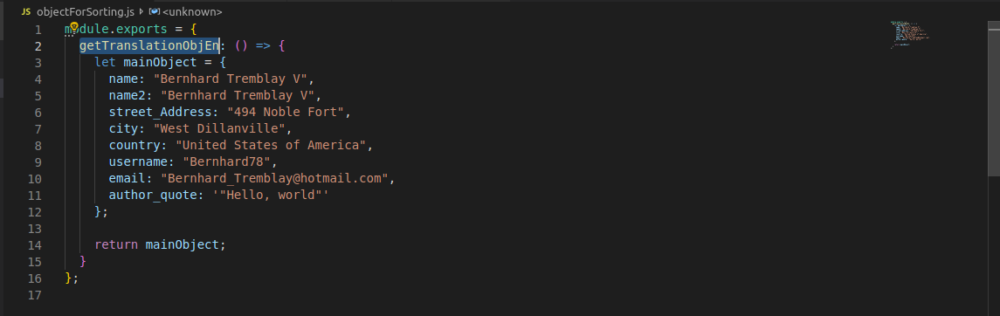
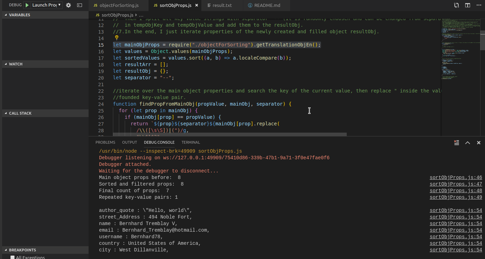

The main purpose of the project is when you have one big object with many and different by keys properties inside and you want to sort them by values. 

For example: 

<h3>BEFORE:</H3>
      
      
       

<h3>AFTER:</h3>

 

One way to use it is to change  the properties of the mainObject with your own in method getTranslationObjEn in objectForSorting.js file

Another way is in file objectForSorting file to remove mine method and  add your own method or just just to add another one. If you decide one of these ways, then you must just change here:

let mainObjProps = require("./objectForSorting").getTranslationObjEn(); 

where you must change getTranslationObjEn() with your own.

