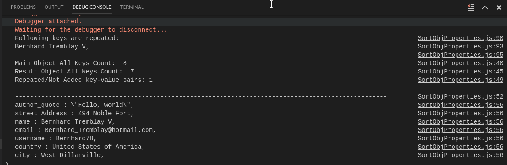

The main purpose of the project is when you have one big object with many and different by keys properties inside and you want to sort them by values. 

For example: 

<h3>BEFORE:</H3>
      
      
       

<h3>AFTER:</h3>

 

One way to use it is to change  the properties of the mainObject with your own in method getTranslationObjEn in objectForSorting.js file

Another way is in file objectForSorting file to remove mine method and  add your own method or just just to add another one. If you decide one of these ways, then you must just change here:

let mainObjProps = require("./objectForSorting").getTranslationObjEn(); 

where you must change getTranslationObjEn() with your own.

There is now second version of the file used ES6 class - <strong>SortObjProperties</strong>

The main difference between sortObjProps and SortObjProperties is that method getSortedObj() in SortObjProperties file return the real object ready for use. On the other hand printObjKeyValues() function in sortObjProps only print on console.

The second difference is that in SortObjProperties there is a method called printRepeatedValues() which write on console all repeating values which are not included in final object.

    

